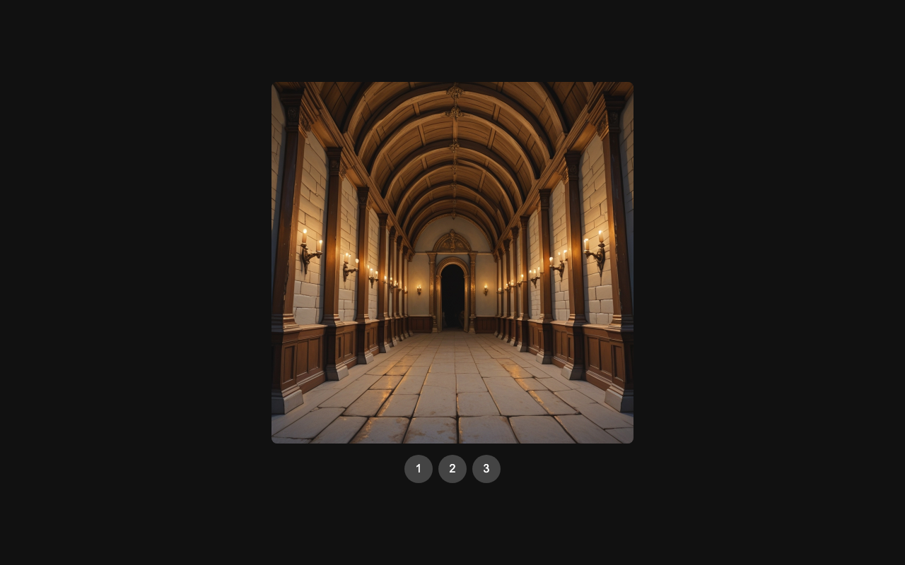

# asset_reconcile ex1 — Step 4 report

Date: 2026-08-08. Outcome: **complete**.

Independent operator-side verification used fresh clean Gitea clones:

- served/game revision: `07085ccaa1ca6472ae699d6f123d465d339ed344`;
- direction/evidence revision: `31a424014037812e4352de4ffcec5a46edf8597b`.

Both clones were clean and exactly matched their remote `main` branches.

## Exact served revision

The node's serve directory contains exactly these eight product files:

```text
index.html
styles.css
gallery-core.js
app.js
assets/manifest.json
assets/images/gallery-image-1.png
assets/images/gallery-image-2.png
assets/images/gallery-image-3.png
```

Each path returned HTTP 200 from
`http://agautolab1.local:8791/game/`. The response body SHA-256 matched the
corresponding file in the `07085cc` clone byte-for-byte:

| File | SHA-256 |
|---|---|
| `index.html` | `43501f7dacbc964d88b6f9ffa979d9d0524b198a31a86e3cdaa49e50055a636e` |
| `styles.css` | `f852fcece234a4fab5fc4b5a252594c814b62707ee072e32da3814575b7ee336` |
| `gallery-core.js` | `d4c71d8efc5b5248ae9691822ce3e7f4eea8df580d4ecd159847ccba0f66bd1f` |
| `app.js` | `e0c5c93c5b9a96b29baad3aecc1a003828547e2eea37a200b21245c42d902dd9` |
| `assets/manifest.json` | `f306638402ee2e7034635f1cc067564a916113f1062716b23cfdceb920020103` |
| `gallery-image-1.png` | `bd1fb853fd1bf1021556bb4a9601efaaa12ca4e8778f370b873d1b7d1cec5ba2` |
| `gallery-image-2.png` | `f83282e0845ad309d0132482fa91d2601e450c852981b98b5e2b405ed40347be` |
| `gallery-image-3.png` | `260f22df574e543217af35fb2d2a8762d54f458cd831754c6286b7c74e039012` |

This proves the named deployment endpoint serves the audited checkout rather
than an equivalent or stale copy.

## Behavior and asset checks

- All seven accepted gates passed again on the operator clone. The four test
  files ran 10/10 subtests, including the actual shipped JavaScript in a DOM
  stub: initially exactly image 1 is active, and each button activates only
  its declared target.
- `index.html` has exactly three local image references and exactly three
  buttons; `app.js` binds every button to `GalleryCore.selectImage` and toggles
  the single `active` image.
- The four product text files contain no HTTP(S), fetch, WebSocket, or other
  external runtime reference.
- All three pulled assets have valid PNG signatures, decodable metadata, and
  exact 1024×1024 dimensions matching the delivered manifest.

The first HTTP/SHA shell loop used a scalar list under zsh and therefore sent
one malformed combined URL. The corrected explicit zsh array then verified all
eight files. This was only an operator verification-command error; no service
or repository state changed.

## Context isolation and durable evidence

`gallery-direction` contains the brief, reconcile tools, and six tracked
review/envelope files. Each envelope has a non-empty desire, compose metadata,
one agforge request ID, mechanical result, verdict, and review metadata.
Candidate bytes remain ignored.

A content scan of every non-image file in `gallery-web` found no medieval,
fantasy, painterly, archaic, direction-brief, desire, or director-review
material. The game repository contains the technical manifest and product only;
the placement-based boundary held.

## Browser evidence

Headless Chromium loaded the actual LAN gateway endpoint directly at a
1280×800 viewport after a three-second image wait. The screenshot visibly
shows the first warm medieval-fantasy image and all three controls:



Screenshot SHA-256:
`4da8d0c3b1d9dd1b3c216d16af56b3f74786ba2951f43a7f1f89d30148bd967a`.
