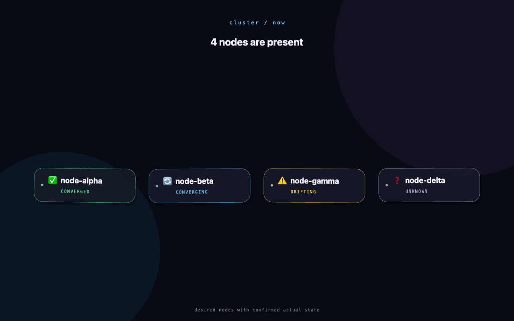

# Report: first_cluster_visualization

The first working cluster visualization is complete. `agdevworld` can fetch a
read-only drift snapshot through cagent, keep it outside Git, derive nodes whose
actual existence is confirmed, and render them as softly floating Phaser
panels.



The committed screenshot deliberately uses `state.sample.json`; it contains no
private cluster payload or real node names.

## Delivered flow

```text
cagent request -> presigned artifact URL -> public/cluster/state.json
                                               |
                                               v
                         validate nctl.drift.v1 and filter nodes
                                               |
                                               v
                               responsive floating Phaser panels
```

- Run `CAGENT_URL=https://agstudio:8789 npm run cluster:fetch` from the
  `agdevworld` directory to refresh the local snapshot.
- The script reads the human bearer token from `CAGENT_TOKEN` or the default
  gitignored token file, polls for up to six minutes, downloads the presigned
  URL immediately, validates the envelope, and atomically writes the snapshot.
- `public/cluster/` is ignored. The real `state.json`, token, and temporary
  download path are not committed.
- The browser loads the live snapshot when present and otherwise uses the
  scrubbed sample.
- Only desired node targets without a missing-realization or
  manual-initial-access diff become panels. Their drift status remains attached
  to the panel model.
- Each panel has deterministic, out-of-phase float and angle tweens. A
  responsive one-to-four-column layout keeps all panels in view as the window
  changes size.

## Live cagent contract used

Entrance: the human listener at `https://agstudio:8789`, using its static
bearer token over the listener's self-signed TLS.

Exact prompt:

> Please run `nctl drift --json`, save the output as a file, upload it with
> `nctl upload`, and reply with only the download URL.

The live proof completed successfully and downloaded an `nctl.drift.v1`
snapshot with `ok: true`. It contained 19 total targets; the visualization
filter derived five confirmed node panels. The cluster-agent interaction was
read-only toward the cluster.

## Acceptance and verification

- Live fetch: passed, including cagent polling, URL extraction, download,
  schema validation, and ignored local write.
- Sample hand count: passed; seven targets reduce to four panels, one for each
  status.
- Live hand count: passed; five confirmed nodes were rendered.
- Production build: `npm run build` passed after every implementation step.
- Desktop visual check: passed at 1280 × 800.
- Resize check: passed at 390 × 844 with all five live panels on screen.
- No-live-snapshot check: passed under Vite; its 200 HTML history fallback is
  detected and the sample JSON is loaded.
- Source hygiene: `git diff --check` passed, and the downloaded payload remains
  ignored.

Vite reports a non-failing bundle-size advisory because Phaser is bundled into
the single current scene. Code splitting is a future optimization, not an
acceptance issue for this episode.

## Commits

Submodule `agdevworld`:

- `5cfc372` — Add cluster snapshot fetch workflow
- `b25122f` — Load and filter cluster node snapshots
- `4891fb4` — Render floating cluster node panels
- `2ccfad0` — Fall back to sample state in Vite dev

Parent `pj-agdev` step commits:

- `59a0378` — Complete cluster visualization step 1
- `5d72a52` — Complete cluster visualization step 2
- `3367265` — Complete cluster visualization step 3

The final Step 4 parent commit contains this report, the scrubbed screenshot,
the Step 4 report, the Vite fallback correction note in Step 2's report, and
the final submodule pointer.

## Follow-ups kept out of scope

Scheduling/live refresh, richer service and relation data, and node interaction
remain future episodes as planned.
